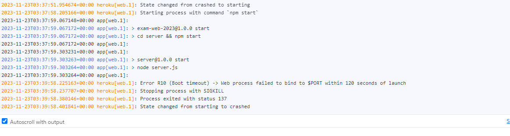

heroku_link = https://apidesign-exam-2023-993399bb202b.herokuapp.com/

github_link = https://github.com/Haakon514/exam-web-2023.git

OM APPLIKLASJONEN:

I starten av oppgaven så var jeg fokusert på å forstå hele oppgaven før jeg begynte å kode. Jeg hadde skrevet kode-
i øvingstimer som kom godt med, og jeg skjønte fort hva jeg måtte ha med i applikasjonen. stylingen er simpel-
Det meste i appliksjonen funker der jeg skriver til, henter og sletter fra mongoDB. jeg bruker websocket for å-displaye
meldinger i nå-tid gjennom chatRoom componenten. jeg har en fungerende react applikasjon med express og parcel.
jeg har også med openidconnect med google for å autorisere brukere.
Jeg fikk dessverre ikke tid til å lage tester, når jeg slet med å fikse feilmeldinger i heroku, og det er noen bugs-
i koden:

Applikasjonen kjører bra på localhost.

BUGS: 

når man sletter eller legger inn en ting så rendrer ikke componenten ordentlig og man på gå inn i en annen komponent-
og ut for å oppdatere komponenten som jeg ikke har tid til å fikse.

det var også en bug med at når man gikk inn i chatroom komponenten uten en cookie så crashet applikasjonen,
så jeg fjernet at man måtte han en cookie, fordi jeg ikke hadde tid til å fikse det, så applikasjonen ikke crasher.

dette fører til en ny bug med at brukere som ikke er autorisert kan bruke chatroomet og skrive til databasen uten et username.
men jeg hadde desverre ikke tid til å fikse det.

Heroku:

fikk ikke kjørt koden på heroku med mange timer med forskjellige forsøk på å få den til å kjøre.
jeg støtte på error meldinger som (h10, h20, r10, shi parcel not found osv.)
jeg klarte å fikse det meste av koden så den skal være mulig å kjøre på heroku uten at heroku blir sinna.
men når jeg prøver å kjøre den så henger den seg opp og i loggen så får jeg h20 og r10 error (boot-timeout).
jeg får deployet koden, men når den prøver å kjøre den så bare henger den seg opp og etter 60 sekunder, git ut (boot-timeout) error.

dette er en av loggene jeg mottok:

Kode tatt fra forelening:

/* OBS! denne koden er tatt fra Johannes Brodwall fra forelisning,
jeg brukte koden fordi det er viktig middleware for serveren.

app.use(async (req, res, next) => {
const { username, access_token } = req.signedCookies;
if (access_token) {
const res = await fetch(DISCOVERY_URL);
const discoveryDoc = await res.json();
        const userinfoRes = await fetch(discoveryDoc.userinfo_endpoint, {
            headers: {
                Authorization: `Bearer ${access_token}`,
            },
        });
        if (!userinfoRes.ok) {
            throw new Error("The error was " + userinfoRes.statusText);
        }
        const userinfo = await userinfoRes.json();

        req.user = { ...userinfo, username: userinfo.email };
    } else {
        req.user = { username };
    }
    next();
});*/

/* OBS! noe av denne koden er tatt fra Johannes Brodwall fra forelisning,
jeg brukte koden fordi det er viktig for loginapi/endepunktene, der jeg brukte litt av koden om igjen og systimatiserte det bedre i et loginApi i et egen fil..

loginApi.post("", (req, res) => {
res.cookie("username", req.body.username, { signed: true });
res.sendStatus(204);
});
loginApi.post("/access_token", (req, res) => {
res.cookie("access_token", req.body.access_token, { signed: true });
res.sendStatus(204);
});
loginApi.get("", (req, res) => {
res.send(req.user);
});
loginApi.delete("", (req, res) => {
res.clearCookie("username");
res.clearCookie("access_token");
res.sendStatus(204);
});

/* OBS! denne koden er tatt fra Johannes Brodwall fra forelisning,
jeg brukte koden fordi det er viktig middleware for serveren.

loginComponentene har det meste fra johannes sine forelesninger, der jeg brukte koden for å spare tid-
til å kode andre ting. jeg så på logincomponentene som veldig viktige for denne applikasjonen, og når de var skrevet-
av johannes i forelesning så er det dint å bruke god kode som funker.
